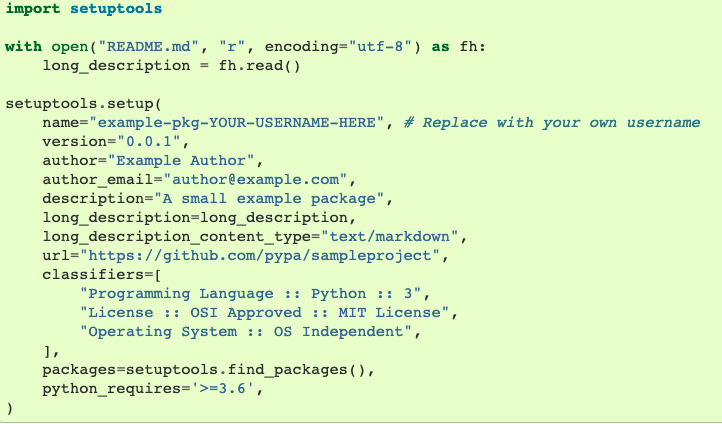
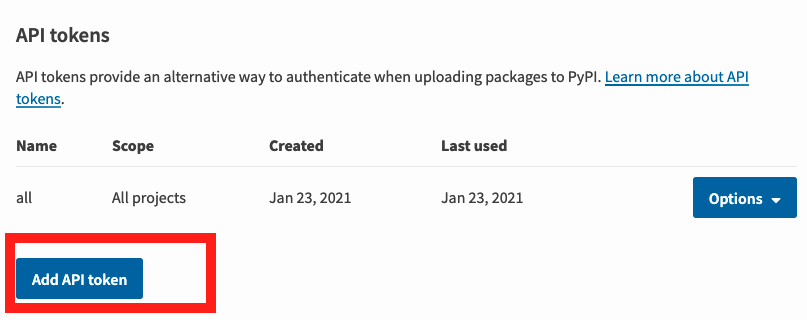
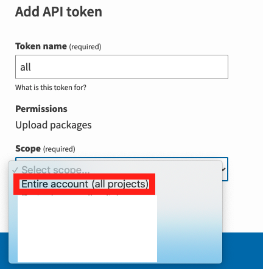
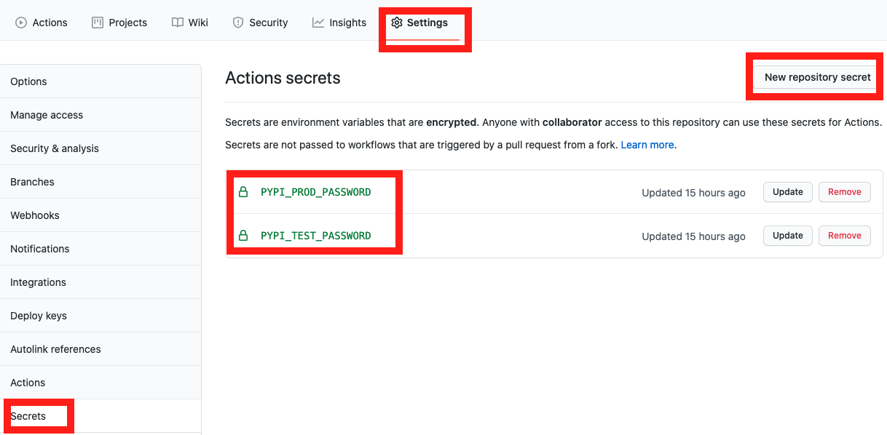

# pypi-hogger

~~Hog all the good PyPi package names~~ Get first dibs on PyPi package names by uploading dummy packages to the desired package namespaces  specified in a YAML file.

The following `package_names_prod.yml` will create two packages in pypi.org's Python Package Index, so you get first dibs on the names. The names of the packages will be `tralala` and `tralala2`.

```yaml
names:
  - tralala
  - tralala2
```

## Overview

The typical process of taking up space on PyPi (the Python package server) is as follows (generally speaking):

* Create a file called `setup.py`
* Fill it with contents like this:

<p align="center">
  
</p>

* Install `twine`, `setuptools`, and `wheel`
* Run this command to build the package: `python setup.py -q sdist bdist_wheel`
* Use Twine to upload the wheel and tarball to the PyPi server: `python -m twine upload --repository-url https://test.pypi.org/legacy/ dist/*`

If you write python packages regularly - or if you just want to claim a name on the server to get first dibs on a potential sweet name - then you might be discouraged from doing that because you need to check your notes and follow this process.

Since we are all Senior YAML engineers at this point, I thought it would be great to skip this process by ~~hogging all the good names~~ noting my name ideas in a YAML file (called `package_names_prod.yml`, and then have GitHub actions take care of the rest for me.

If I feel like using one of the names, then I can remove it from the `package_names_prod.yml` file (to avoid duplicate uploads and failed upload events) and then automate the package upload process from wherever my new tool lives.

## Instructions

* Fork this repository

* Create a PyPI API token so you will be able to securely upload your project by following the steps below.

* Go to [https://test.pypi.org/manage/account/#api-tokens](https://test.pypi.org/manage/account/#api-tokens) and create a new API token. The button is shown in the screenshot below.

<p align="center">
  
</p>

* When you select the token scope - don’t limit its scope to a particular project, since you are creating a new project. See the screenshot below.

<p align="center">
  
</p>

* Don’t close the page until you have copied and saved the token — you won’t see that token again.

* Go back to the GitHub repository. Navigate to `Settings` -> `Secrets` -> `New repository secret`. Each of the fields are shown in the image below.

<p align="center">
  
</p>

* Name the secret `PYPI_TEST_PASSWORD`. For the secret value, get the token string that you got from [https://test.pypi.org/manage/account/#api-tokens](https://test.pypi.org/manage/account/#api-tokens) and paste it into the field, and hit save.
* Follow the same steps for the Production secret, but with the following values:
  - URL: [https://pypi.org/manage/account/#api-tokens](https://pypi.org/manage/account/#api-tokens)
  - Secret name: `PYPI_PROD_PASSWORD`

* To hog names in the test.pypi.org server, edit the `package_names_test.yml` file:

```yaml
names:
  - tralala
  - tralala2
```
* To hog names in the pypi.org server, edit the `package_names_prod.yml` file:

```yaml
names:
  - goonsquad
  - tralala
```

* Commit your changes.
* To validate your name on the pypi.org server, search for the project name here: https://pypi.org/project
* To validate your name on the test.pypi.org server, search for the project name here: https://test.pypi.org/project

* Now, whenever you have a great name idea and want to get first dibs on the name in PyPi before someone else gets it, just edit the YAML file and it should take the space for you!

# References

* [Packaging Tutorial](https://packaging.python.org/tutorials/packaging-projects/)
* [SetupTools source code](https://github.com/pypa/setuptools/tree/main/setuptools)
* [Twine source code](https://github.com/pypa/twine/)
* [Uploading Distribution archives](https://packaging.python.org/tutorials/packaging-projects/#uploading-the-distribution-archives)
